

**ПРАВИТЕЛЬСТВО РОССИЙСКОЙ ФЕДЕРАЦИИ**

**ФЕДЕРАЛЬНОЕ ГОСУДАРСТВЕННОЕ АВТОНОМНОЕ**
**ОБРАЗОВАТЕЛЬНОЕ УЧРЕЖДЕНИЕ ВЫСШЕГО ОБРАЗОВАНИЯ**
**НАЦИОНАЛЬНЫЙ ИССЛЕДОВАТЕЛЬСКИЙ УНИВЕРСИТЕТ**
**«ВЫСШАЯ ШКОЛА ЭКОНОМИКИ»**

Факультет компьютерных наук
Образовательная программа «Программная инженерия»

---

| СОГЛАСОВАНО | УТВЕРЖДАЮ |
|:---|:---|
| Научный руководитель, ассистент департамента программной инженерии | Академический руководитель образовательной программы «Программная инженерия» старший преподаватель департамента программной инженерии |
| ________________ В. С. Смолин | ________________ Н. А. Павлочев |
| «___» _____________ 2025 г. | «___» _____________ 2025 г. |

---

**Фамильный Круг — сервис совместного создания и визуализации семейного древа**

**Руководство оператора**

**ЛИСТ УТВЕРЖДЕНИЯ**

RU.17701729.05.01-**01 34 01-1-ЛУ**

---

Исполнитель студент
группы БПИ-235
__________ / Д. Е. Баженов /
«____» _____________ 2025 г.

---

**Москва 2025**

---

УТВЕРЖДЁН
RU.17701729.05.01-01 34 01-1-ЛУ

---

**Фамильный Круг — сервис совместного создания и визуализации семейного древа**

**Руководство оператора**

RU.17701729.05.01-**01 34 01-1**

Листов 22

---

**Москва 2025**

---

## ОГЛАВЛЕНИЕ

- [АННОТАЦИЯ](#аннотация)
- [1. НАЗНАЧЕНИЕ ПРОГРАММЫ](#1-назначение-программы)
  - [1.1. Функциональное назначение](#11-функциональное-назначение)
  - [1.2. Эксплуатационное назначение](#12-эксплуатационное-назначение)
  - [1.3. Состав функций](#13-состав-функций)
- [2. УСЛОВИЯ ВЫПОЛНЕНИЯ ПРОГРАММЫ](#2-условия-выполнения-программы)
  - [2.1. Минимальный состав технических и программных средств](#21-минимальный-состав-технических-и-программных-средств)
  - [2.2. Требования к пользователю](#22-требования-к-пользователю)
- [3. ВЫПОЛНЕНИЕ ПРОГРАММЫ](#3-выполнение-программы)
  - [3.1. Запуск приложения](#31-запуск-приложения)
  - [3.2. Описание страницы входа](#32-описание-страницы-входа)
  - [3.3. Описание страницы регистрации](#33-описание-страницы-регистрации)
  - [3.4. Описание страницы «Мои деревья»](#34-описание-страницы-мои-деревья)
  - [3.5. Описание графа семейного дерева](#35-описание-графа-семейного-дерева)
  - [3.6. Описание режима «Веер»](#36-описание-режима-веер)
  - [3.7. Описание режима «Хронология»](#37-описание-режима-хронология)
  - [3.8. Добавление нового участника дерева](#38-добавление-нового-участника-дерева)
  - [3.9. Описание панели персоны](#39-описание-панели-персоны)
  - [3.10. Описание страницы «Люди»](#310-описание-страницы-люди)
  - [3.11. Описание поиска по дереву](#311-описание-поиска-по-дереву)
  - [3.12. Описание функции «Путь родства»](#312-описание-функции-путь-родства)
  - [3.13. Описание статистики дерева](#313-описание-статистики-дерева)
  - [3.14. Описание экспорта дерева](#314-описание-экспорта-дерева)
  - [3.15. Описание импорта GEDCOM](#315-описание-импорта-gedcom)
  - [3.16. Описание журнала изменений](#316-описание-журнала-изменений)
  - [3.17. Описание страницы «Участники»](#317-описание-страницы-участники)
  - [3.18. Описание страницы «Профиль»](#318-описание-страницы-профиль)
  - [3.19. Описание страницы «Приглашения»](#319-описание-страницы-приглашения)
  - [3.20. Тёмная тема](#320-тёмная-тема)
- [4. СООБЩЕНИЯ ОПЕРАТОРУ](#4-сообщения-оператору)
- [ЛИСТ РЕГИСТРАЦИИ ИЗМЕНЕНИЙ](#лист-регистрации-изменений)

---

## АННОТАЦИЯ

Данный документ представляет собой руководство оператора для работы с веб-приложением «Фамильный Круг — сервис совместного создания и визуализации семейного древа». Руководство предназначено для конечных пользователей системы и содержит описание функциональных возможностей приложения, требований к техническому и программному обеспечению, порядок запуска и эксплуатации приложения, а также перечень возможных сообщений, отображаемых системой, и рекомендации по их обработке.

---

## 1. НАЗНАЧЕНИЕ ПРОГРАММЫ

### 1.1. Функциональное назначение

Приложение «Фамильный Круг» предназначено для создания, хранения и совместного редактирования интерактивных семейных деревьев. Основной функционал включает:

- построение генеалогического дерева с визуализацией связей между членами семьи;
- хранение биографической информации о родственниках (даты, места рождения/смерти, фотографии, документы);
- поддержку совместного редактирования дерева несколькими пользователями с разграничением прав доступа;
- импорт и экспорт данных в стандартных генеалогических форматах (GEDCOM, JSON, PDF, PNG, SVG);
- просмотр событий жизни родственников в хронологическом порядке.

### 1.2. Эксплуатационное назначение

Приложение является веб-сервисом и предназначено для использования в домашних условиях, а также в профессиональной деятельности генеалогов и историков семей. Доступ к приложению осуществляется через стандартный браузер без необходимости установки дополнительного программного обеспечения. Предусмотрены два режима участия в дереве: владелец и соучастник с назначенной ролью (редактор, наблюдатель, комментатор).

### 1.3. Состав функций

- **Управление деревьями:** создание, редактирование и удаление семейных деревьев; приглашение участников по электронной почте с назначением роли.
- **Управление людьми:** добавление, редактирование и удаление карточек участников дерева с указанием имени, фамилии, пола, дат и мест рождения/смерти, фотографии и биографических заметок.
- **Управление связями:** установка связей «родитель–ребёнок», «супруги», «опекун», «усыновлённый».
- **Визуализация:** три режима отображения дерева — классическое «Древо», круговой «Веер» и «Хронология».
- **Поиск:** быстрый поиск участника по имени внутри дерева с переходом к его карточке на графе.
- **Путь родства:** определение степени и характера родства между двумя выбранными участниками дерева.
- **Медиа:** загрузка фотографий и документов (PDF, DOC, XLS, TXT) к карточкам персон и к событиям.
- **События:** добавление именованных событий (рождение, брак, переезд и др.) с датой, местом и описанием.
- **Комментарии:** добавление текстовых комментариев к карточкам участников.
- **Статистика:** автоматический расчёт и отображение статистики дерева (число поколений, распределение по полу, возрасту, распространённые фамилии).
- **Экспорт:** выгрузка дерева в форматах PDF, PNG, SVG, GEDCOM (.ged) и JSON.
- **Импорт:** загрузка данных из файла формата GEDCOM с предварительным просмотром содержимого.
- **Журнал изменений:** аудит-лог всех действий участников дерева (добавление, редактирование, удаление связей и людей).
- **Тёмная тема:** переключение интерфейса между светлой и тёмной цветовой схемой.

---

## 2. УСЛОВИЯ ВЫПОЛНЕНИЯ ПРОГРАММЫ

### 2.1. Минимальный состав технических и программных средств

Для работы с приложением пользователю необходим компьютер или мобильное устройство со следующими характеристиками:

**Аппаратные требования:**

| Компонент | Минимум | Рекомендуется |
|---|---|---|
| Процессор | 1,5 ГГц, 2 ядра | 2,0 ГГц, 4 ядра |
| Оперативная память | 2 ГБ | 4 ГБ |
| Разрешение экрана | 1280 × 720 | 1920 × 1080 |
| Интернет-соединение | 1 Мбит/с | 10 Мбит/с |

**Программные требования:**

| Компонент | Требование |
|---|---|
| Операционная система | Windows 10 / macOS 12 / Ubuntu 20.04 или новее |
| Веб-браузер | Google Chrome 110+, Mozilla Firefox 110+, Microsoft Edge 110+, Safari 16+ |
| Поддержка JavaScript | Обязательна (включена по умолчанию) |
| Поддержка SVG | Обязательна (поддерживается всеми современными браузерами) |

Дополнительная установка программного обеспечения не требуется. Приложение полностью работает в браузере.

### 2.2. Требования к пользователю

Пользователь должен обладать базовыми навыками работы с веб-браузером и персональным компьютером: умением открывать веб-страницы, заполнять формы, загружать файлы. Специальной подготовки или технических знаний не требуется.

---

## 3. ВЫПОЛНЕНИЕ ПРОГРАММЫ

### 3.1. Запуск приложения

Для запуска приложения пользователю необходимо:

1. Открыть установленный веб-браузер.
2. В адресной строке ввести адрес приложения и нажать клавишу **Enter**.
3. Дождаться загрузки страницы входа.

Приложение не требует предварительной установки. При первом посещении система автоматически перенаправляет неавторизованного пользователя на страницу входа.

### 3.2. Описание страницы входа

При открытии приложения неаутентифицированный пользователь видит страницу входа (см. Рисунок 1). Страница разделена на две части:

- **Левая часть** — приветственный блок с описанием возможностей приложения.
- **Правая часть** — форма входа с полями «Email» и «Пароль».

Для входа пользователю необходимо:

1. Ввести адрес электронной почты в поле **Email**.
2. Ввести пароль в поле **Пароль** (для просмотра пароля нажать иконку глаза).
3. Нажать кнопку **Войти**.

При успешной аутентификации система перенаправляет пользователя на страницу «Мои деревья». При вводе неверных данных отображается сообщение об ошибке.

Для перехода к регистрации нового аккаунта следует нажать ссылку **Зарегистрироваться**.

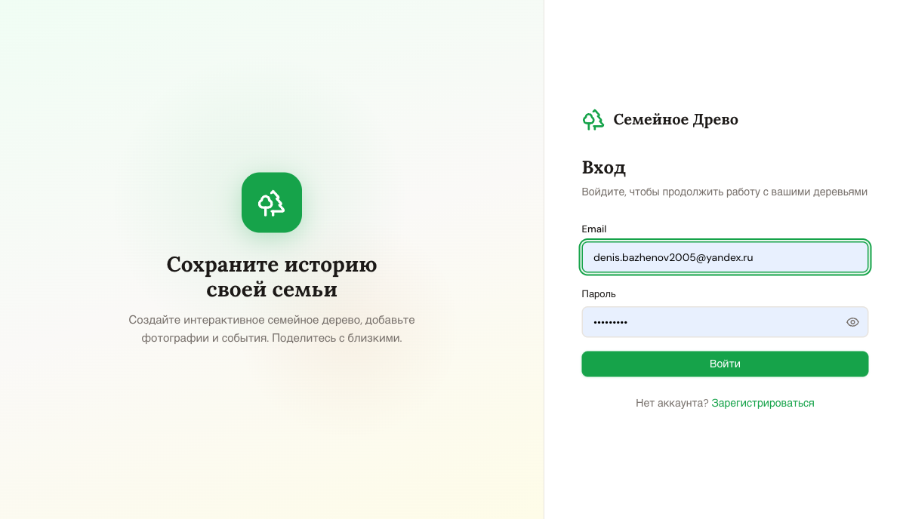

*Рисунок 1 — Страница входа*

### 3.3. Описание страницы регистрации

Страница регистрации (см. Рисунок 2) позволяет создать новую учётную запись. Форма содержит следующие поля:

- **Имя** (необязательно) — отображаемое имя пользователя; при вводе автоматически обновляется аватар.
- **Email** — адрес электронной почты, используемый как логин.
- **Пароль** — минимум 6 символов.

После заполнения полей следует нажать кнопку **Создать аккаунт**. Для возврата на страницу входа нажать ссылку **Войти**.

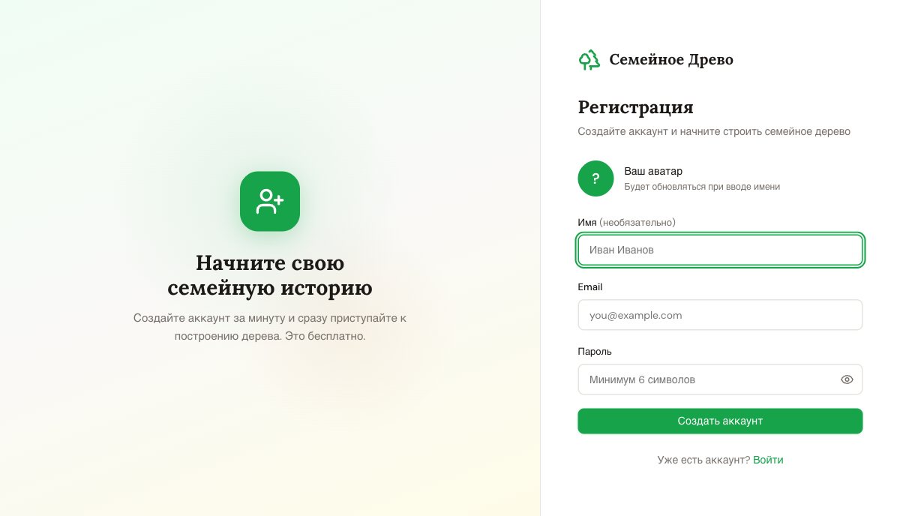

*Рисунок 2 — Страница регистрации*

### 3.4. Описание страницы «Мои деревья»

После успешного входа пользователь попадает на главную страницу приложения — «Мои деревья» (см. Рисунок 3). Страница содержит:

- **Левая панель навигации** — ссылки на разделы «Мои деревья», «Приглашения», «Профиль», а также информация о текущем пользователе, кнопки переключения темы и выхода из системы.
- **Список карточек деревьев** — каждая карточка отображает название дерева, роль пользователя (Владелец / Редактор / Наблюдатель / Комментатор), число людей, событий и медиафайлов, дату создания и обновления. Карточка выделена цветной полосой в соответствии с ролью.

Доступные действия на странице:

- **Открыть дерево** — кнопка «Открыть» на карточке; переход к графу дерева.
- **Управление участниками** — иконка в левом нижнем углу карточки; переход к списку участников.
- **Редактировать** — иконка карандаша; изменение названия и описания дерева.
- **Удалить** — иконка корзины; удаление дерева (только для владельца).
- **Создать новое дерево** — кнопка **+ Новое дерево** в правом верхнем углу.

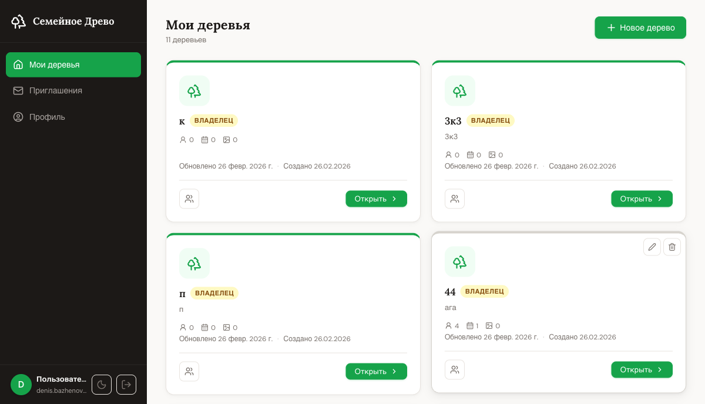

*Рисунок 3 — Страница «Мои деревья»*

### 3.5. Описание графа семейного дерева

При нажатии кнопки «Открыть» пользователь переходит к графу семейного дерева (см. Рисунок 4) — основному рабочему экрану приложения.

**Верхняя панель инструментов** содержит:

- Стрелку назад и название дерева с меткой роли.
- Поле поиска по участникам.
- Кнопки переключения режима отображения: **Древо**, **Веер**, **Хронология**.
- Кнопку обновления данных.
- Кнопку **Добавить** — добавление нового участника.
- Кнопку **«...» (Ещё)** — дополнительные функции.

**Граф дерева** отображает участников в виде цветных кружков (синий — мужской пол, розовый — женский, серый — не указан). Внутри кружков — инициалы или фотография. Под кружком — имя и год рождения участника.

Управление графом:

- **Клик по кружку** — открытие боковой панели с данными о персоне.
- **Кнопка «+»** над кружком — добавление нового участника в связи с данной персоной.
- **Кнопка «–»** под кружком — свернуть/развернуть ветвь потомков.
- **Кнопки «+» / «–»** в правом нижнем углу — масштабирование графа.
- **Кнопка рамки** — сброс масштаба и центрирование графа.
- **Перетаскивание** графа мышью — перемещение по полотну.

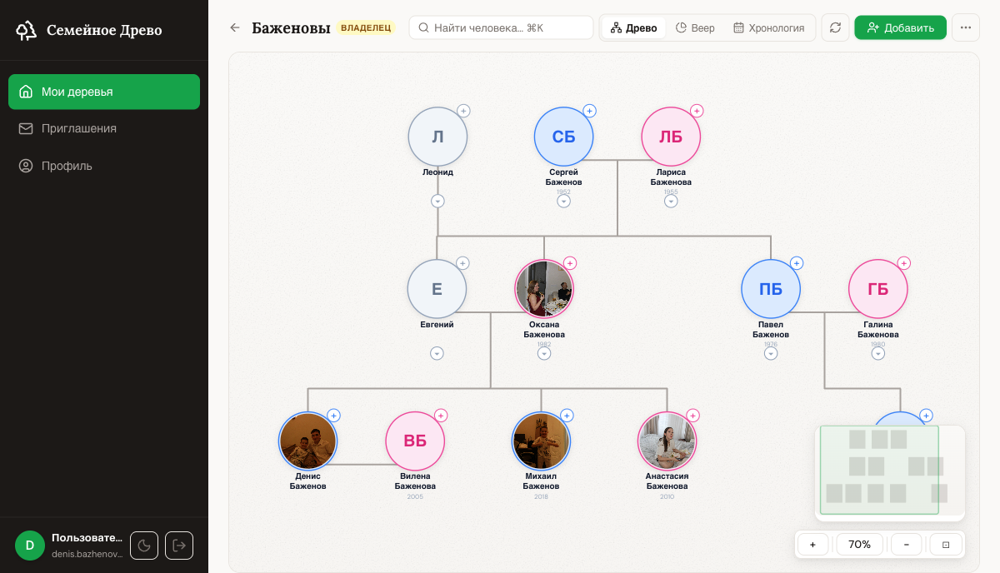

*Рисунок 4 — Граф семейного дерева*

### 3.6. Описание режима «Веер»

Режим «Веер» (см. Рисунок 5) отображает участников дерева в виде концентрических дуговых секторов, что позволяет компактно отобразить несколько поколений одновременно. Центр круга показывает общее число участников. Каждый сектор соответствует одному участнику; цвет сектора соответствует полу.

Переключение в режим «Веер» производится кнопкой **Веер** в верхней панели инструментов.

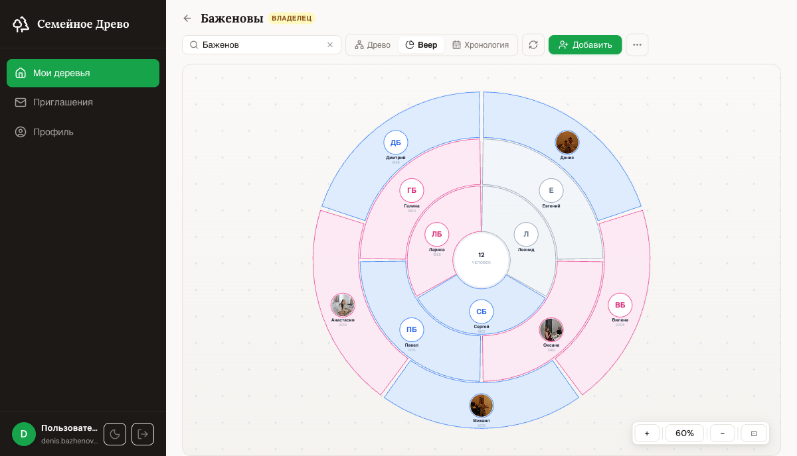

*Рисунок 5 — Режим отображения «Веер»*

### 3.7. Описание режима «Хронология»

Режим «Хронология» (см. Рисунок 6) отображает события участников дерева в хронологическом порядке на временной шкале. Для отображения данных необходимо предварительно добавить события к участникам дерева (раздел 3.9). Переключение осуществляется кнопкой **Хронология** в верхней панели.

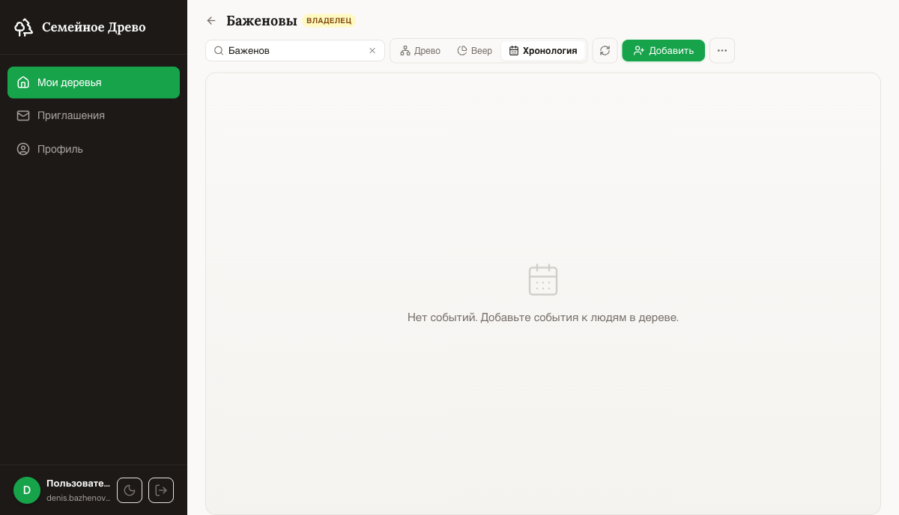

*Рисунок 6 — Режим отображения «Хронология»*

### 3.8. Добавление нового участника дерева

Для добавления нового человека в дерево необходимо нажать кнопку **Добавить** в верхней панели или кнопку «+» рядом с существующей карточкой. Откроется модальное окно «Новая карточка» (см. Рисунок 7), содержащее следующие поля:

- **Имя** (обязательное) — имя участника.
- **Фамилия** — фамилия участника.
- **Пол** — выбор: Мужской / Женский / Другой.
- **Дата рождения** — в формате ДД.ММ.ГГГГ.
- **Дата смерти** — в формате ДД.ММ.ГГГГ (если применимо).
- **Место рождения** — текстовое поле.
- **Место смерти** — текстовое поле.
- **Фото** — кнопка загрузки фотографии.
- **Биография / заметки** — произвольный текст.

После заполнения полей нажать кнопку **Создать**. Участник появится на графе дерева.

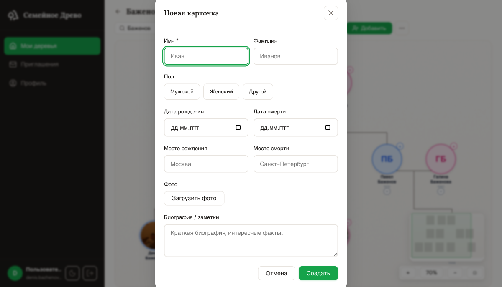

*Рисунок 7 — Форма добавления нового участника*

### 3.9. Описание панели персоны

При нажатии на карточку участника в графе открывается боковая панель с подробной информацией (см. Рисунок 8). Панель содержит четыре вкладки:

**Вкладка «Обзор»** — основная биографическая информация о персоне и раздел комментариев. В поле ввода под заголовком «Комментарии» можно написать комментарий и отправить его нажатием **Enter**.

**Вкладка «События»** (см. Рисунок 9) — список жизненных событий участника (рождение, свадьба, переезд и др.). Для добавления события нажать кнопку **+ Добавить**.

**Вкладка «Файлы»** — фотографии и документы, прикреплённые к персоне. Поддерживаются форматы изображений и PDF/DOC/TXT.

**Вкладка «Связи»** — список родственных связей персоны (родители, дети, супруги, опекуны).

Внизу панели расположены кнопки:
- **Редактировать** — открывает форму редактирования данных персоны.
- **Удалить** — удаление участника из дерева (требует подтверждения).

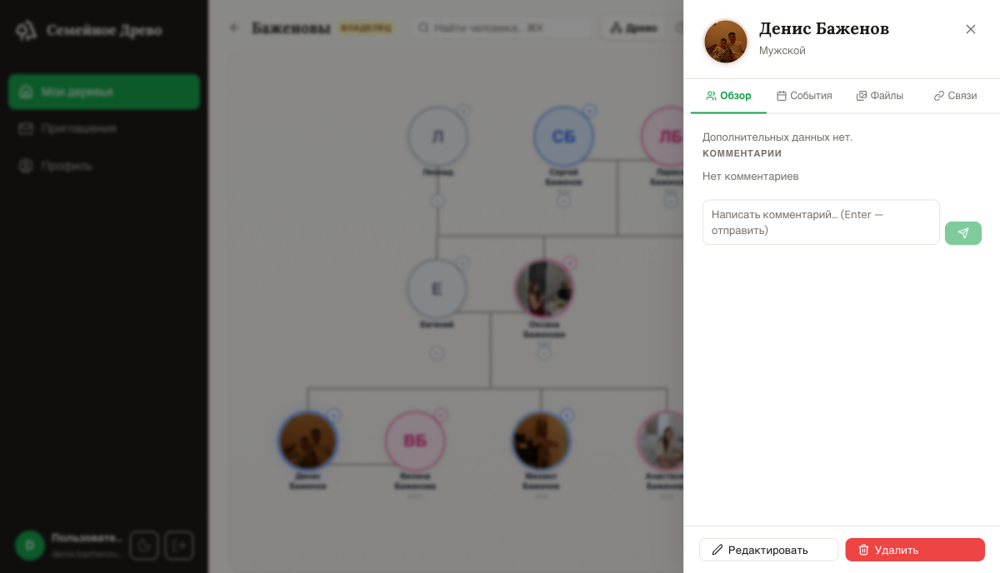

*Рисунок 8 — Панель персоны, вкладка «Обзор»*

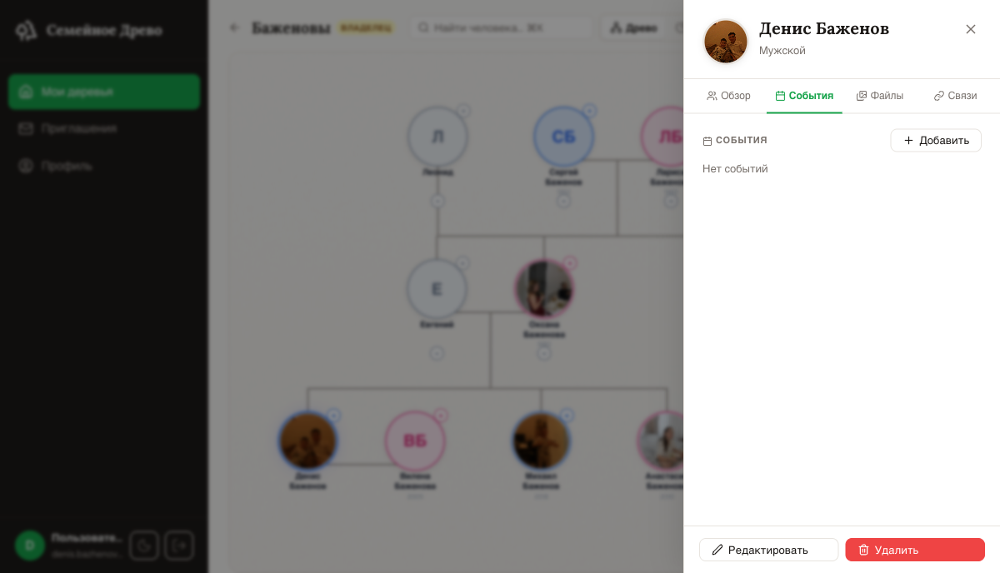

*Рисунок 9 — Панель персоны, вкладка «События»*

### 3.10. Описание страницы «Люди»

Страница «Люди» (см. Рисунок 10) содержит полный список участников дерева в табличном виде. Доступ к странице: меню **«...» → Люди** или из страницы дерева.

Список отображает для каждого участника: фото/аватар, имя и фамилию, пол и год рождения. Доступны следующие действия:

- **Поиск** по имени через поле «Поиск по имени...».
- **Редактировать** — иконка карандаша справа от записи.
- **Удалить** — иконка корзины справа от записи.
- **Добавить** — кнопка **Добавить** в правом верхнем углу.

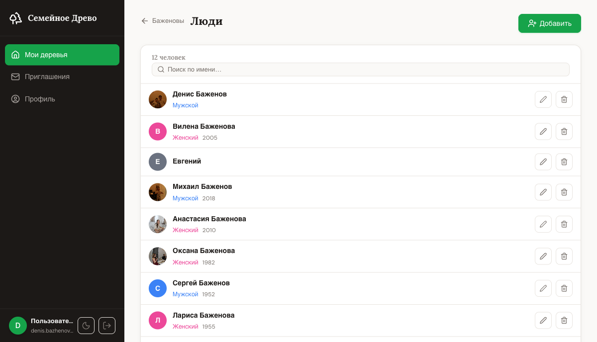

*Рисунок 10 — Страница «Люди»*

### 3.11. Описание поиска по дереву

Для быстрого нахождения участника в большом дереве следует воспользоваться полем поиска в верхней панели графа (см. Рисунок 11). При вводе текста система в реальном времени отображает выпадающий список совпадающих участников с указанием года рождения.

При нажатии на имя в списке граф автоматически центрируется на карточке выбранного участника и открывает его боковую панель.

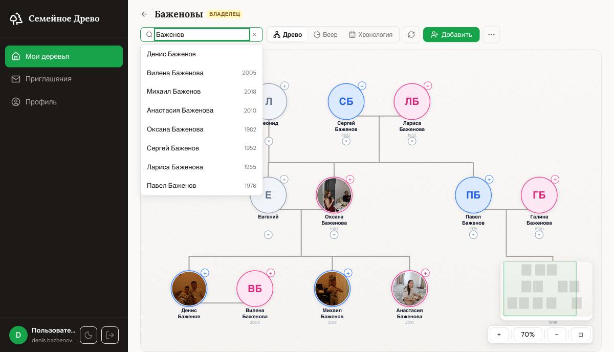

*Рисунок 11 — Поиск по дереву*

### 3.12. Описание функции «Путь родства»

Функция «Путь родства» (см. Рисунок 12) позволяет определить степень и характер родства между двумя участниками дерева. Для доступа: нажать **«...» → Путь родства**.

В открывшемся модальном окне выбрать двух участников из выпадающих списков «От кого» и «До кого». Система рассчитает кратчайший путь по связям дерева и отобразит цепочку родства.

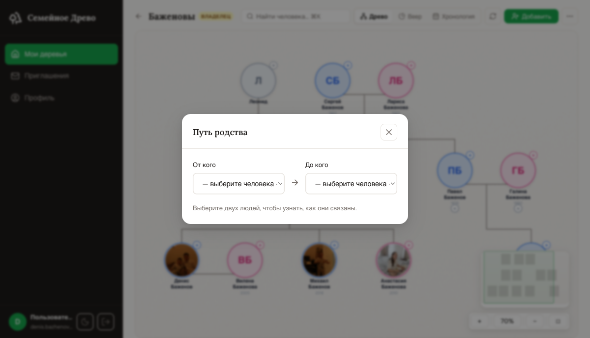

*Рисунок 12 — Модальное окно «Путь родства»*

### 3.13. Описание статистики дерева

Функция статистики (см. Рисунок 13) предоставляет автоматически вычисляемые аналитические данные по дереву. Для доступа: **«...» → Статистика**.

Модальное окно «Статистика дерева» отображает:

- Общее число людей с разбивкой на живых и умерших.
- Число поколений.
- Среднюю продолжительность жизни.
- Среднее число детей на одного родителя.
- Старшего и младшего живого участника.
- Распределение по полу (диаграмма).
- Типы связей (количество супружеских и родительских связей).
- Наиболее распространённые фамилии.

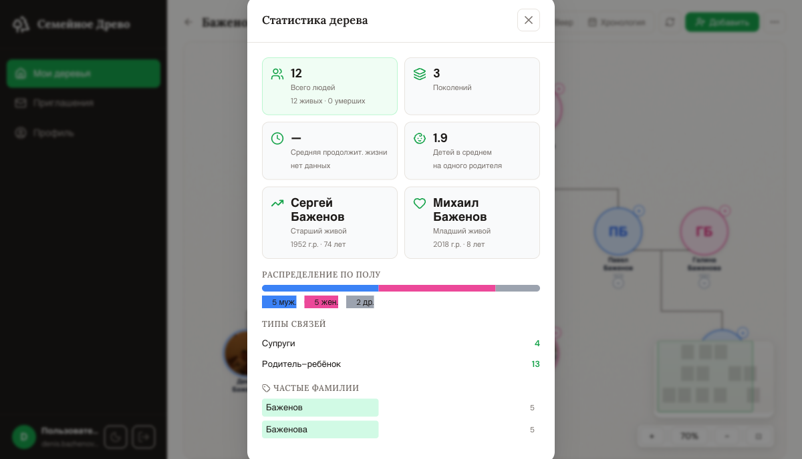

*Рисунок 13 — Статистика дерева*

### 3.14. Описание экспорта дерева

Функция экспорта (см. Рисунок 14) позволяет сохранить данные дерева в различных форматах. Для доступа: **«...» → Экспорт**.

Модальное окно «Экспорт дерева» предлагает следующие форматы:

| Формат | Описание |
|---|---|
| **PDF — для печати** | Открывает диалог печати с деревом и списком людей |
| **PNG — изображение 2×** | Растровое изображение высокого разрешения |
| **SVG — векторная графика** | Масштабируемый формат; совместим с Figma, Illustrator |
| **GEDCOM (.ged)** | Стандарт генеалогии; совместим с Ancestry, MyHeritage, FamilySearch |
| **JSON — полный дамп данных** | Все люди, связи и медиа в машиночитаемом формате; для резервных копий |

Для экспорта нажать на нужный формат в списке.

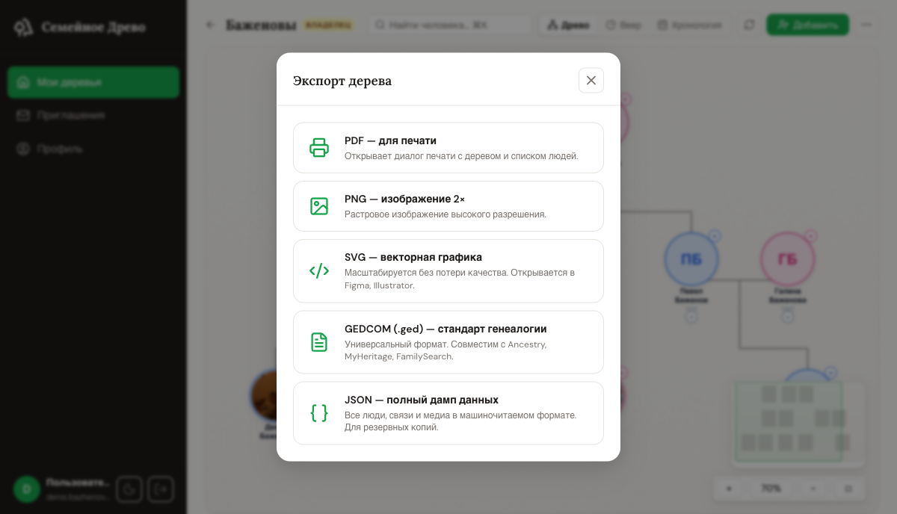

*Рисунок 14 — Модальное окно «Экспорт дерева»*

### 3.15. Описание импорта GEDCOM

Функция импорта (см. Рисунок 15) позволяет загрузить данные из файла формата GEDCOM (.ged) в существующее дерево. Для доступа: **«...» → Импорт GEDCOM**.

Порядок работы:

1. В модальном окне «Импорт GEDCOM» перетащить файл `.ged` в область загрузки или нажать на неё для открытия диалога выбора файла.
2. Нажать кнопку **Предпросмотр** для просмотра содержимого файла перед импортом.
3. После проверки данных подтвердить импорт.

Импортированные люди и связи добавляются к уже существующим данным дерева. Дубликаты не удаляются автоматически.

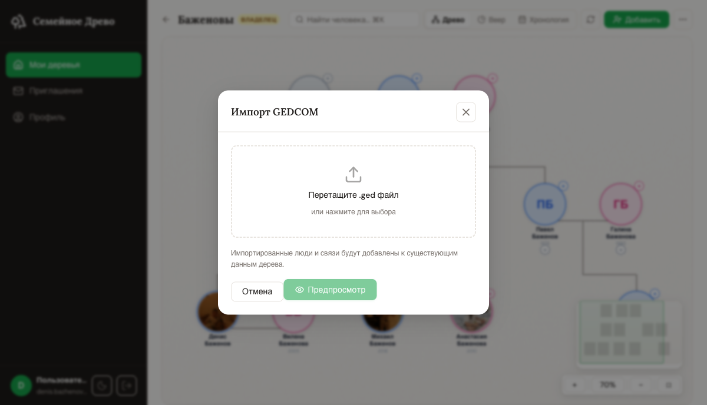

*Рисунок 15 — Модальное окно «Импорт GEDCOM»*

### 3.16. Описание журнала изменений

Журнал изменений (см. Рисунок 16) отображает историю всех действий участников дерева. Для доступа: **«...» → Журнал изменений**.

В модальном окне «Журнал изменений» отображается список записей в обратном хронологическом порядке. Каждая запись содержит:

- Иконку типа действия (добавление, удаление, редактирование).
- Аватар и имя пользователя, совершившего действие.
- Описание действия (например, «добавил(а) связь», «добавил(а) человека»).
- Время события (относительное, например «59 дн. назад»).

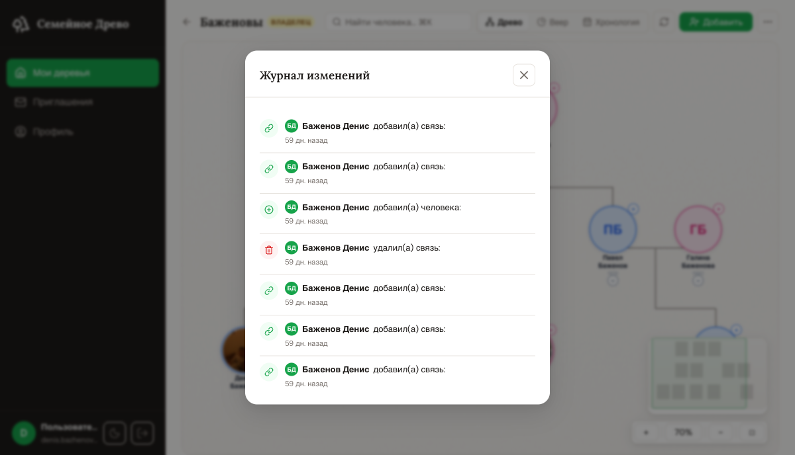

*Рисунок 16 — Журнал изменений*

### 3.17. Описание страницы «Участники»

Страница «Участники» (см. Рисунок 17) отображает список пользователей, имеющих доступ к данному дереву. Для доступа: **«...» → Участники** или иконка участников на карточке дерева.

Для каждого участника отображаются: аватар, адрес электронной почты, метка «Вы» (для текущего пользователя) и роль (Владелец / Редактор / Наблюдатель / Комментатор).

Для приглашения нового участника владелец нажимает кнопку **Пригласить** в правом верхнем углу, вводит email приглашаемого и выбирает роль. Приглашение отправляется на указанный адрес.

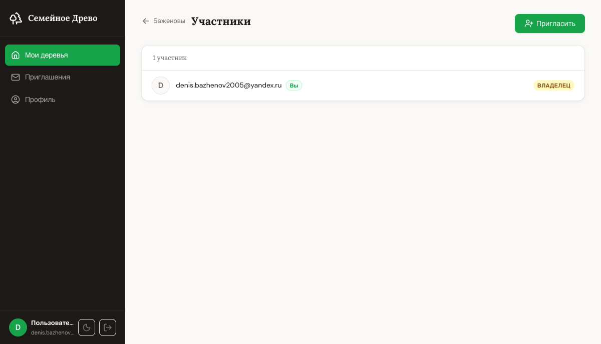

*Рисунок 17 — Страница «Участники»*

### 3.18. Описание страницы «Профиль»

Страница «Профиль» (см. Рисунок 18) предоставляет инструменты управления учётной записью. Доступ: пункт **Профиль** в левой панели навигации.

Страница содержит два блока:

**Основные данные:**
- Аватар (автоматически генерируется из первой буквы имени).
- Счётчики: количество деревьев и общее число людей во всех деревьях.
- Поле **Email** (только для чтения).
- Поле **Отображаемое имя** — редактируемое.
- Кнопка **Сохранить** для применения изменений.

**Смена пароля:**
- Поле «Текущий пароль».
- Поле «Новый пароль» (минимум 6 символов).
- Поле «Подтвердите новый пароль».
- Кнопка **Изменить пароль**.

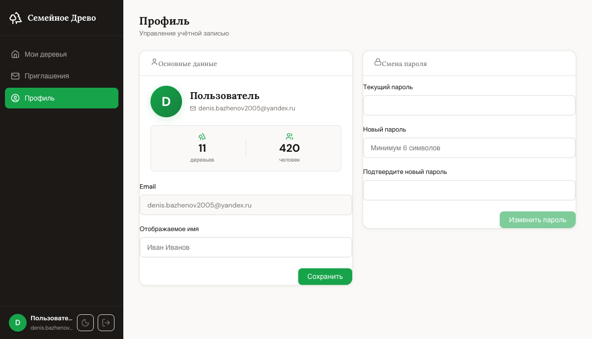

*Рисунок 18 — Страница «Профиль»*

### 3.19. Описание страницы «Приглашения»

Страница «Приглашения» (см. Рисунок 19) отображает входящие приглашения в семейные деревья от других пользователей. Доступ: пункт **Приглашения** в левой панели навигации.

При наличии входящих приглашений для каждого из них отображаются название дерева, имя пригласившего пользователя и назначенная роль. Пользователь может принять или отклонить приглашение нажатием соответствующих кнопок.

При отсутствии приглашений отображается сообщение «Нет входящих приглашений».

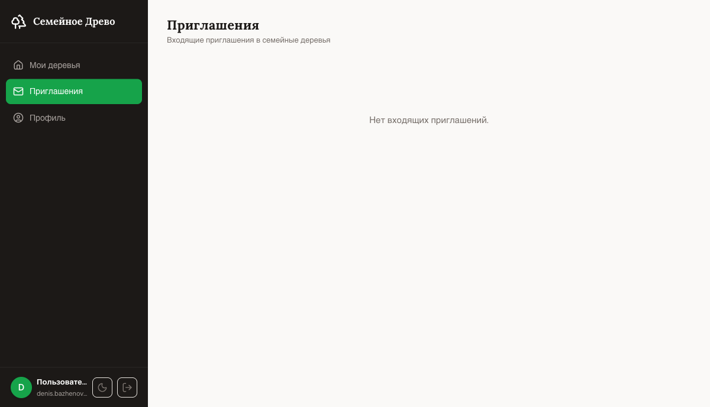

*Рисунок 19 — Страница «Приглашения»*

### 3.20. Тёмная тема

Приложение поддерживает тёмную цветовую схему интерфейса (см. Рисунок 20). Для переключения между светлой и тёмной темой следует нажать кнопку с иконкой луны/солнца в нижней части левой панели навигации (рядом с информацией о пользователе). Выбранная тема сохраняется в настройках браузера и применяется автоматически при следующем открытии приложения.

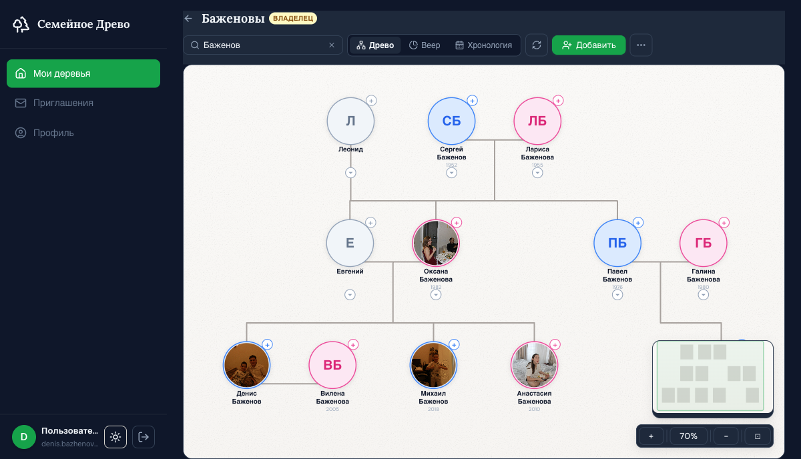

*Рисунок 20 — Тёмная тема интерфейса*

---

## 4. СООБЩЕНИЯ ОПЕРАТОРУ

В процессе работы с приложением пользователю могут отображаться следующие сообщения:

| Сообщение | Причина | Действие оператора |
|---|---|---|
| «Неверный логин или пароль» | Введены некорректные учётные данные | Проверить правильность email и пароля; убедиться, что аккаунт зарегистрирован |
| «Пользователь с таким email уже существует» | Попытка регистрации на уже занятый email | Использовать другой адрес электронной почты или войти в существующий аккаунт |
| «Пароли не совпадают» | Поля «Пароль» и «Подтверждение пароля» содержат разные значения | Повторно ввести пароль в оба поля |
| «Пароль должен содержать минимум 6 символов» | Введён слишком короткий пароль | Выбрать пароль длиннее 5 символов |
| «Имя обязательно» | Не заполнено обязательное поле «Имя» при создании карточки | Ввести имя участника |
| «Нет входящих приглашений» | Текущий пользователь не получал приглашений | Дождаться приглашения от владельца дерева |
| «Нет событий. Добавьте события к людям в дереве» | В режиме «Хронология» у участников не добавлено ни одного события | Перейти в панель персоны → вкладка «События» → добавить событие |
| «Выберите двух людей, чтобы узнать, как они связаны» | Функция «Путь родства» открыта, но участники не выбраны | Выбрать двух участников из выпадающих списков |
| «Импортированные люди и связи будут добавлены к существующим данным дерева» | Информационное сообщение при импорте GEDCOM | Убедиться в правильности выбранного файла перед нажатием «Предпросмотр» |
| Ошибка сети / «Не удалось загрузить данные» | Потеря соединения с сервером | Проверить подключение к интернету и обновить страницу |
| «Дополнительных данных нет» | В карточке персоны не заполнены биографические поля | Нажать «Редактировать» для добавления информации |
| «Нет комментариев» | К персоне ещё не добавлено комментариев | Написать комментарий в поле ввода и нажать Enter |

---

## ЛИСТ РЕГИСТРАЦИИ ИЗМЕНЕНИЙ

| Изм. | Лист | № докум. | Подп. | Дата |
|---|---|---|---|---|
| | | | | |

| RU.17701729.05.01-01 34 01-1 | | | | |
|---|---|---|---|---|
| Инв. № подл. | Подп. и дата | Взам. Инв. № | Инв. № дубл. | Подп. и дата |
| | | | | |
